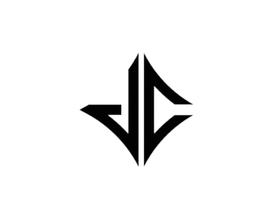

<a name="readme-top">

<br/>

<br />
<div align="center">
  <a href="https://github.com/xjancarlo/">
  <!-- TODO: If you want to add logo or banner you can add it here -->
    
  </a>
<!-- TODO: Change Title to the name of the title of your Project -->
  <h3 align="center">Personal Website v2</h3>
</div>
<!-- TODO: Make a short description -->
<div align="center">
  Welcome to my personal website, a hub showcasing my work portfolio, basketball achievements, professional resume, and favorite Mobile Legends characters. Connect with me easily through direct links to my social media profiles.
</div>

<br />

<!-- TODO: Change the zyx-0314 into your github username  -->
<!-- TODO: Change the WD-Template-Project into the same name of your folder -->


---

<br />
<br />

<!-- TODO: If you want to add more layers for your readme -->
<details>
  <summary>Table of Contents</summary>
  <ol>
    <li>
      <a href="#overview">Overview</a>
      <ol>
        <li>
          <a href="#key-components">Key Components</a>
        </li>
        <li>
          <a href="#technology">Technology</a>
        </li>
      </ol>
    </li>
    <li>
      <a href="#rules-and-principles">Rules and Principles</a>
    </li>
    <li>
      <a href="#resources">Resources</a>
    </li>
  </ol>
</details>

---

## Overview

<!-- TODO: To be changed -->
<!-- The following are just sample -->
Welcome to my personal website, a comprehensive showcase of my work, basketball achievements, professional resume, and passion for Mobile Legends. Explore my portfolio to see my projects and accomplishments. Dive into my basketball journey, highlighting key milestones and accolades. View my detailed resume to learn about my skills and experiences. Discover my favorite Mobile Legends characters and their unique traits. Stay connected through direct links to my social media profiles, making it easy for you to get in touch with me.

Guiding Question:
- What is the project

    The project is a personal website showcasing various aspects of my life, including my work, basketball achievements, professional resume, and favorite Mobile Legends characters. It also features links to my social media profiles for easy contact.

- Whats the purpose

    The purpose of the website is to provide a comprehensive and engaging platform for visitors to learn about my professional accomplishments, personal interests, and to facilitate easy communication through social media links.

### Key Components
<!-- TODO: List of Key Components -->
<!-- The following are just sample -->
  - Portfolio: Displaying my work and projects.
  - Basketball Achievements: Highlighting key milestones and accolades in my basketball journey.
  - Resume: Showcasing my skills, experiences, and professional background.

### Technology
<!-- TODO: List of Technology Used -->


## Rules and Principles
1. Always use ***WD-*** in the front of the Title of the Project for the Subject followed by your custom naming.
2. Do not rename any .html files; always use 'index.html' as the filename.
3. File Structure to follow

```
WD-FINALS
└─ assets
|   └─ css
|   |   └─ style.css
|   └─ img
|   |   └─ back-btn.png
|   |   └─ jc.png
|   |   └─ jc-logo.png
|   └─ js
|       └─ script.js
└─ pages
|  └─ basketball-page
|     └─ assets
|     |  └─ css
|     |  |  └─ style.css
|     |  └─ img
|     |  |  └─ b1-1.jpg
|     |  |  └─ b1-2.jpg
|     |  |  └─ b2-1.jpg
|     |  |  └─ b2-2.jpg
|     |  |  └─ b3-1.jpg
|     |  |  └─ b3-2.jpg
|     |  |  └─ b3-3.jpg
|     |  |  └─ b3-4.jpg
|     |  └─ js
|     |     └─ script.js
|  └─ mobile-legends-page
|     └─ assets
|     |  └─ css
|     |  |  └─ style.css
|     |  └─ img
|     |  |  └─ chou.png
|     |  |  └─ edith.png
|     |  |  └─ math.png
|     |  |  └─ rafa.png
|     |  └─ js
|     |     └─ script.js
|     └─ index.html
|  └─ resume-page
|     └─ assets
|     |  └─ css
|     |  |  └─ style.css
|     |  └─ img
|     |  └─ js
|     |     └─ script.js
|     └─ index.html
|  └─ mobile-legends-page
|     └─ assets
|     |  └─ css
|     |  |  └─ style.css
|     |  └─ img
|     |  |  └─ wd-2.png
|     |  |  └─ wd-3.png
|     |  |  └─ wd-4.png
|     |  └─ js
|     |     └─ script.js
|     └─ index.html
└─ index.html
└─ readme.md
```
## File Structure Explanation
- The file structure of the project is organized as follows:

- WD-FINALS: The root directory containing all project files.
  - assets: A directory for shared assets used across the entire project.
    - css: Contains the main stylesheet for the project (`style.css`).
    - img: Stores images such as `back-btn.png`, `jc.png`, and `jc-logo.png`.
    - js: Contains the main JavaScript file (`script.js`).
  - pages: A directory for different pages of the website, each with its own subdirectory.
    - basketball-page: Contains assets and content specific to the basketball-themed page.
      - assets: Subdirectory for page-specific assets.
        - css: Stylesheet for the basketball page (`style.css`).
        - img: Images used on the basketball page (e.g., `b1-1.jpg`, `b2-1.jpg`).
        - js: JavaScript file for the basketball page (`script.js`).
    - mobile-legends-page: Contains assets and content specific to the Mobile Legends-themed page.
      - assets: Subdirectory for page-specific assets.
        - css: Stylesheet for the Mobile Legends page (`style.css`).
        - img: Images used on the Mobile Legends page (e.g., `chou.png`, `edith.png`).
        - js: JavaScript file for the Mobile Legends page (`script.js`).
      - index.html: HTML file for the Mobile Legends page.
    - resume-page: Contains assets and content specific to the resume page.
      - assets: Subdirectory for page-specific assets.
        - css: Stylesheet for the resume page (`style.css`).
        - img: Images used on the resume page.
        - js: JavaScript file for the resume page (`script.js`).
      - index.html: HTML file for the resume page.
  - index.html: The main landing page of the website.
  - readme.md: The README file providing project details and instructions.

This structured approach ensures that assets and content are organized and easily accessible for each specific page, promoting maintainability and scalability of the project.

## Links of Website and Project Repositories
- https://github.com/xjancarlo/WD-SW2
- https://github.com/xjancarlo/WD-SW3
- https://github.com/xjancarlo/WD-SW4
- https://github.com/xjancarlo/WD-FINALS

## Deployment Instructions
- https://scribehow.com/shared/Deploy_a_website_using_GitHub_Pages__UyFSCsflSte7l0IhcvFFdg?referrer=documents